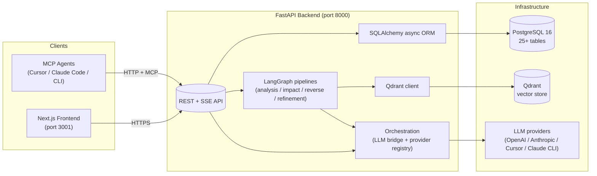
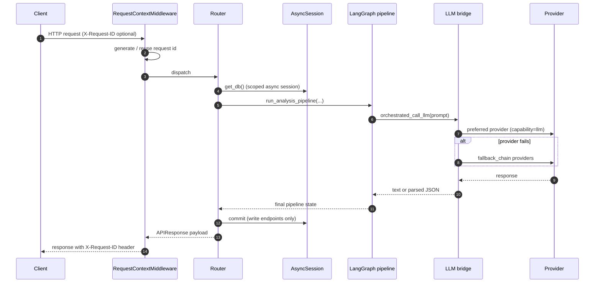
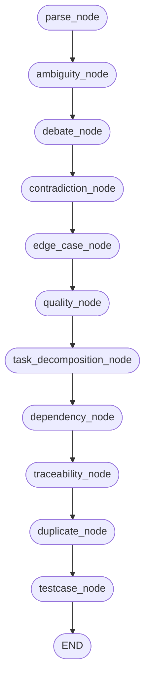
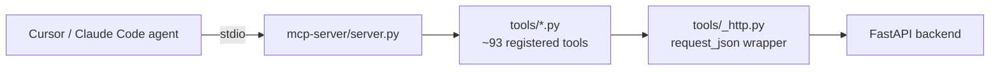

# FS Intelligence Platform — Architecture

This document captures the end-to-end architecture of the platform at a level
that is useful for onboarding engineers, code reviews, and AI coding agents.
It complements the user-facing walkthroughs in `docs/MANUAL.md` and the
subscription-tool guides in `docs/GUIDE_*.md`.

---

## 1. System Overview



Each box in the diagram maps to a concrete folder:

| Component | Source |
|-----------|--------|
| Frontend | `frontend/src/app`, `frontend/src/components`, `frontend/src/lib/api.ts` |
| REST + SSE API | `backend/app/api/*_router.py`, `backend/app/main.py` |
| LangGraph pipelines | `backend/app/pipeline/graph.py`, `backend/app/pipeline/refinement_graph.py`, `backend/app/pipeline/nodes/` |
| Orchestration | `backend/app/orchestration/` |
| SQLAlchemy ORM | `backend/app/db/` + `backend/alembic/` |
| Vector store | `backend/app/vector/` |
| MCP server | `mcp-server/server.py`, `mcp-server/tools/`, `mcp-server/prompts/` |

---

## 2. Request lifecycle



Key invariants enforced in the code:

* Every inbound request gets an `X-Request-ID` header and structured access
  log line (`backend/app/middleware.py`).
* Unhandled exceptions render a consistent `{error, code, request_id}` JSON
  envelope (`backend/app/errors.py`).
* `get_db` (`backend/app/db/base.py`) skips the commit round-trip on
  read-only requests for lower latency.

---

## 3. Analysis pipeline

`backend/app/pipeline/graph.py` builds the LangGraph shown below. Per-section
nodes honour the `changed_indices` set so targeted re-analysis (`POST
/api/fs/{id}/analyze?sections=1,3`) only re-runs the affected nodes.



Sibling pipelines live in the same module:

* **Impact** — `version_node → impact_node → rework_node`
* **Reverse FS** — `reverse_fs_node → reverse_quality_node`
* **Refinement** — `issues_collector → suggestion → rewriter → validation`
  (`backend/app/pipeline/refinement_graph.py`)

Every node emits structured errors through `append_node_error`
(`backend/app/pipeline/errors.py`) rather than swallowing exceptions, and LLM
calls flow through `pipeline_call_llm[_json]` with `llm_retry`
(`backend/app/llm/retry.py`) providing exponential backoff + jitter.

---

## 4. Orchestration

Providers are registered once in `ToolRegistry` (`backend/app/orchestration/registry.py`)
and selected per capability:

```mermaid
flowchart LR
  subgraph Registry
    api[APIProvider\n(LLM)]
    claude[ClaudeCodeProvider\n(LLM + build)]
    cursor[CursorProvider\n(build)]
  end
  Pipeline -->|capability=llm| Registry
  Registry -->|preferred| claude
  claude -.fails.-> FallbackChain[["fallback_chain"]] --> api
  Pipeline -->|capability=build| Registry
  Registry --> cursor
```

Resolved configuration comes from `ToolConfigDB` (user `default`), cached in
`backend/app/orchestration/config_resolver.py`. In strict mode
(`ORCHESTRATION_STRICT_LLM=true`) the `"api"` provider is **not** silently
appended to the fallback chain so that misconfiguration surfaces as an error
rather than degrading silently.

---

## 5. Data model & migrations

* SQLAlchemy models: `backend/app/db/models.py` (25+ tables).
* Async engine + session factory: `backend/app/db/base.py`.
* Alembic tooling: `backend/alembic/`; `init_db` first runs
  `Base.metadata.create_all` then `alembic upgrade head`.
* Per-table indexes on hot `fs_id` columns are created by migration
  `0004_analysis_indexes`.

---

## 6. MCP server



Every tool communicates with the backend through `request_json`, which
returns a consistent `{error, status_code}` envelope on failures so downstream
agents can branch deterministically. The `agent_loop` prompt
(`mcp-server/prompts/agent_loop.py`) enforces:

1. **Discover** — `get_document`, `list_sections`, `get_quality_score`.
2. **Analyze** — `trigger_analysis`, review ambiguities / contradictions.
3. **Plan** — `get_tasks`, `get_dependency_graph`, build plan snapshot.
4. **Execute** — per-task `update_task` + `register_file` + `verify_task_completion`.
5. **Verify** — `post_build_check`, exports.

Any `update_build_state` call must include `current_phase` and
`current_task_index` — the prompt spells this out explicitly.

---

## 7. Frontend

The Next.js app uses the App Router. Key shared surfaces:

* `src/components/Toaster.tsx` — global toast + aria-live region.
* `src/components/Modal.tsx` — modal with focus trap and return-focus.
* `src/components/Tabs.tsx` — roving tabindex + arrow-key navigation.
* `src/lib/api.ts` — typed client, throws `APIError` on non-2xx with parsed
  `code`, `request_id`, and `detail`.

The `/documents/[id]/build` page subscribes to
`GET /api/mcp/sessions/{id}/events/stream` via SSE to render live autonomous
build progress, file registry, and snapshot history.

---

## 8. Testing matrix

| Layer | Tooling | Scope |
|-------|---------|-------|
| Backend unit / integration | `pytest` (+ `pytest-asyncio`) | Routers (`test_*_router.py`), refinement graph, orchestration e2e, pipeline_llm JSON parsing, zip-slip security. |
| MCP | `pytest` | Tool registration (`test_mcp_tools_registration.py`) + contract tests (`test_mcp_contract.py`). |
| Frontend | `vitest` + `@testing-library/react` | `apiFetch` parsing, toast store, theme SSR, Modal focus trap, Tabs keyboard nav. |
| CI | GitHub Actions (`.github/workflows/ci.yml`) | Backend pytest + ruff, frontend lint + typecheck + vitest + build, MCP registration tests. |
